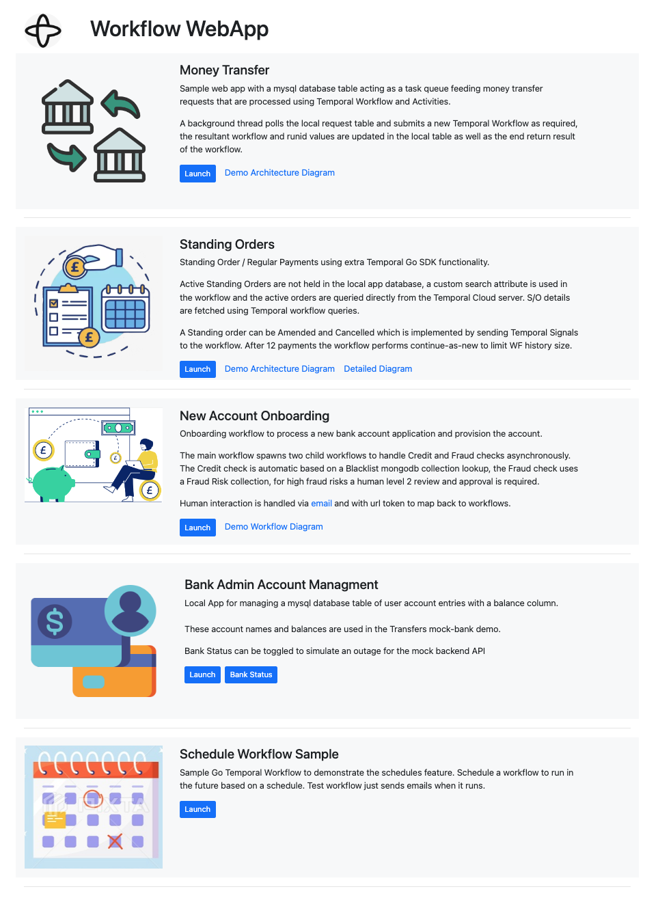

# Sample Go webapp with Temporal workflow backend
Sample golang web app framework to launch a modular set of application components demonstrating various aspects of Temporal

## Main App Menu Home Page / Demo Component Launcher
The main webapp.go provides a launcher home screen to access the various application components.

## Component Docs
For details of each component see the linked readme files:

First, please follow the various setup steps for setting up the shell environment, Temporal namespace search attributes used and starting the various dependances in docker.

- [Setup](docs/Setup.md)

Docs:  
- [Money Transfer](docs/MoneyTransfer.md)
- [Standing Orders / Regular fixed payments](docs/StandingOrders.md)
- [New Account Onboarding with Manual Approval](docs/AccountOnboarding.md)
- [Bank Admin Account Management](docs/AccountManagement.md)
- [Freestanding SDK management of Schedules feature](docs/ScheduleWorkflow.md)
  
    
    
## Temporal Demo Overview

### What is Demonstrated?
Use this demo to show the **simplicity** and **durability** enabled by Temporal for business process developers, in a financial services context.

#### Focus on coding the business flow predictably as if there are no distributed systems, let Temporal handle the risks of the distributed reality
* It should be simple for an application to survive a if it crashes or terminates in the middle of a transaction. With Temporal, this is simple. The Temporal runtime makes your your code run to completion, surviving failures along the way.
* It should be simple with Temporal for an application to survive if a critical service it calls is down or unavailable. With Temporal, this is simple.

[Example code](./moneytransfer/transfer-workflow.go) (other than using the SDK).

#### Enjoy simple future programming interface with Temporal
It should be simple to create code that runs at a specific time or times in the future without complexity or confusion, or having your system trip over itself in the future. With Temporal, this is simple and easy to do, even schedules from user input, such as a scheduled business process, for example moving money. Simple to create, simple to understand, simple to debug, simple to test.
[Example code](./scheduleworkflow/start-scheduleworkflow.go).

#### Coordinate and reuse existing workflows
It should be simple to work with multiple levels of workflow orchestration. With Temporal, you can create multiple levels of orchestration simply.
[Example code](./standingorder/sorder-workflow.go#209).

#### Create long-running business processses and update workflows once started
It should be easy to update existing business processes while they are in progress.
[Example code](./standingorder/sorder-workflow.go#96).

#### Model real-life objects and long-running processes with workflows.
It should be possible to create entities that have a workflow associated with them. Temporal can do this and manage both the wofkflow and its related entity.
  
| Primary Value Demonstration | ✅ |  
|:-------------------|---|  
| Velocity          | ✅ |  
| Reliability       | ✅ |  
| Insight           |   |  

#### Deployment
| Deployment          | ✅ |  
|:-------------------|---|  
| Local              | ✅ |  
| Disconnected       | 🚫 |  
| Kubernetes         |  |  

#### Prerequisites
| Prerequisite       | ✅ |  
|:-------------------|---|  
| Network Connection | ✅ |  
| Go             | ✅|  
| Docker             | ✅|  
| mongdb             | ✅|  
| Temporal CLI | ✅ |  

#### Features
| Feature            | ✅ |  
|:-------------------|---|  
| Schedule       | ✅ |  
| Local Activity | ✅ |  
| Signal         | ✅ |  
| Query          | ✅ |  
| Update         | ✅ |  
| Heartbeat      |   |  
| Timer          | ✅ |  
| Activity Retry | ✅ |  
| Cron           |   |  
| Data Converter | ✅ |  

#### Patterns
| Pattern            | ✅ |  
|:-------------------|---|  
| Entity              | ✅ |  
| Fanout              |   |  
| Long-polling        |   |  
| Continue As New     | ✅ |  
| Long-running        | ✅ |  
| Manual Intervention | ✅ |  
| Saga                | ✅ |  

#### Additional Features
| Feature            | ✅ |  
|:-------------------|---|  
| User Interface   | ✅ |  

