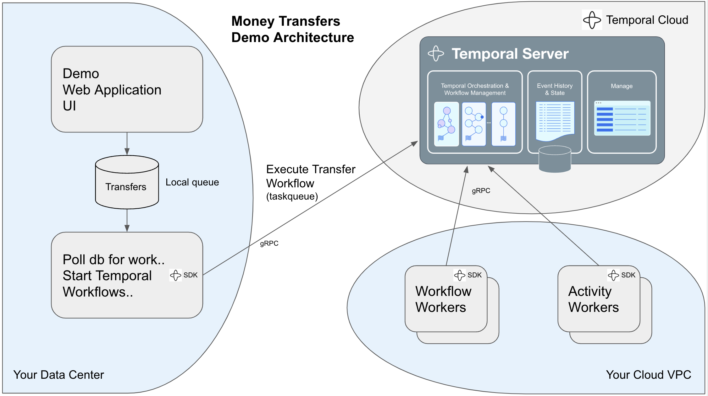

# Money Transfers
A sample workflow to demonstrate money transfers started periodically from a database queue.  
  
  
  
## Demo Architecture

  
## The webapp spawns a cron thread that polls the transfers table

The webapp.go has a background activity thread that periodically polls the database transfer table on a go cron timer looking for entries with status "REQUESTED", if an entry is found it reads the oldest and updates it to "PROCESSING" and starts a corresponding Temporal Workflow.  

Example polling can be seen in the webapp terminal:

```
go run webapp.go
2023/06/06 11:36:22 Serve Http on 8085
2023/06/06 11:36:52 CheckTransferQueueTask: called
2023/06/06 11:36:52 QueryTransferRequest: called
2023/06/06 11:36:52 CheckTransferQueueTask: No transfers in queue.
2023/06/06 11:37:22 CheckTransferQueueTask: called
2023/06/06 11:37:22 QueryTransferRequest: called
2023/06/06 11:37:22 CheckTransferQueueTask: No transfers in queue.
...
```

When the transfer poll task does find a pending entry the log looks like:
```
2023/06/06 11:39:03 CheckTransferQueueTask: called
2023/06/06 11:39:03 QueryTransferRequest: called
2023/06/06 11:39:04 QueryTransferRequest: Transfer: {4 bill ted 10 transfer request PROCESSING}
2023/06/06 11:39:04 CheckTransferQueueTask: Transfer: {4 bill ted 10 transfer request PROCESSING}
2023/06/06 11:39:04 CheckTransferQueueTask: PaymentDetails: {bill ted transfer request 10}
2023/06/06 11:39:04 StartMoneyTransfer-72937: called, PaymentDetails: moneytransfer.PaymentDetails{SourceAccount:"bill", TargetAccount:"ted", ReferenceID:"transfer request", Amount:10}
2023/06/06 11:39:04 StartMoneyTransfer-72937: Starting moneytransfer workflow on go-moneytransfer task queue
2023/06/06 11:39:04 StartMoneyTransfer-72937: Started workflow: WorkflowID: go-txfr-webtask-wkfl-72937, RunID: 09d781d2-8d95-4926-a458-b6f2ac49ad37
2023/06/06 11:39:33 CheckTransferQueueTask: called
2023/06/06 11:39:33 QueryTransferRequest: called
2023/06/06 11:39:34 CheckTransferQueueTask: No transfers in queue.
2023/06/06 11:40:03 CheckTransferQueueTask: called
2023/06/06 11:40:03 QueryTransferRequest: called
2023/06/06 11:40:04 CheckTransferQueueTask: No transfers in queue.
2023/06/06 11:40:09 StartMoneyTransfer-72937: Workflow result: "Transfer complete (transaction IDs: W4081768757, D2204353735)"
2023/06/06 11:40:09 StartMoneyTransfer-72937: done.
2023/06/06 11:40:09 UpdateTransferRequest: called (Id: 4 COMPLETED )
2023/06/06 11:40:09 CheckTransferQueueTask: Workflow: go-txfr-webtask-wkfl-72937 Completed
```

## Start the temporal Transfer worker

In a different terminal window to the webapp to separate the terminal log output displayed.

```
cd moneytransfer
go run worker/main.go

2023/06/06 11:27:05 Go worker starting..
2023/06/06 11:27:05 LoadClientOptions: myns.abcdf.tmprl.cloud:7233 myns.abcdf ~/.temporal/tclient-myns.pem ~/.temporal/tclient-myns.key   false true
2023/06/06 11:27:05 Go worker connecting to server..
2023/06/06 11:27:05 Go worker initialising..
2023/06/06 11:27:05 Go worker registering for Workflow moneytransfer.Transfer..
2023/06/06 11:27:05 Go worker registering for Activity moneytransfer.Withdraw..
2023/06/06 11:27:05 Go worker registering for Activity moneytransfer.Deposit..
2023/06/06 11:27:05 Go worker registering for Activity moneytransfer.Refund..
2023/06/06 11:27:05 Go worker listening on go-moneytransfer task queue..
2023/06/06 11:27:05 INFO  Started Worker Namespace myns.abcdf TaskQueue go-moneytransfer WorkerID 94006@gmini.local@
```

Note: the sample worker registers with the taskqueue to handle Workflow and Activity actions for the Transfer Workflow example


## WebApp Transfers UI

### List Transfers


### New Transfer


### Transfer Details (COMPLETED)


### Transfer Details (FAILED)


Note: This failed as ted's account was configured with 10 and a transfer of 100 was requested.  
```go
    {AccountNumber: "ted", Balance: 10},
```

The Activity retry policy will keep retrying unless the activity returns specific error types listed:
```go
    NonRetryableErrorTypes: []string{"InvalidAccountError", "InsufficientFundsError"},
```


## Test some failure states

### Two workers, second one picks up workflow where left by "failed" worker

There is a sleep timer between the Withdraw and Deposit Activities.  This allows two workers to be started and the one that is sleeping exited to observe the other picking up the transaction where it was left off.


### Simulate Banking Client unavailable

You can disable the Banking app Deposit function by setting the Bank Open/Closed status in the Bank App UI:


The Activity return policy does not contain:
```go
func (m *BankIntermittentError) Error() string {
  return "Banking Service currently unavailable"
}
```
so the activity will loop retrying, backing off etc..  


Change the bank status back to Open to simulate bank back up.  


Notice the Workflow History for the affected Withdraw or Deposit Activity will have a multiple retry count:


  

