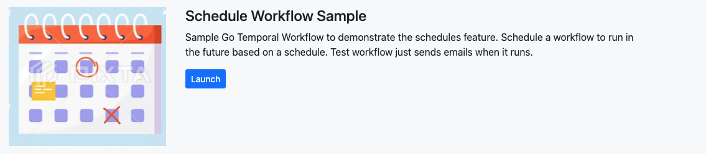
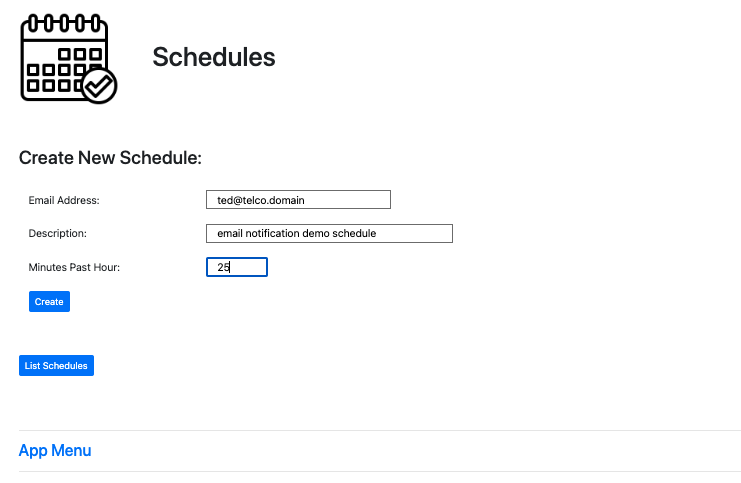
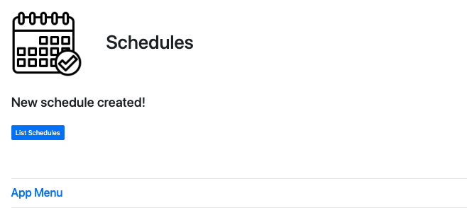
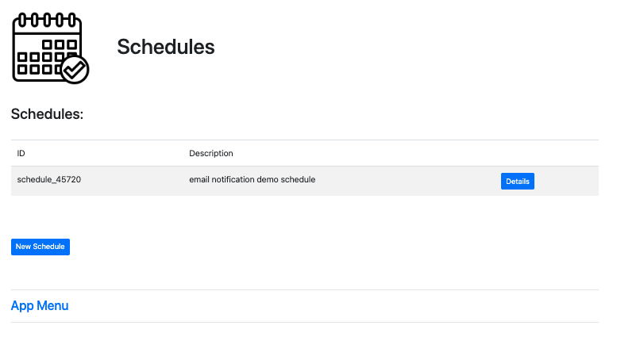
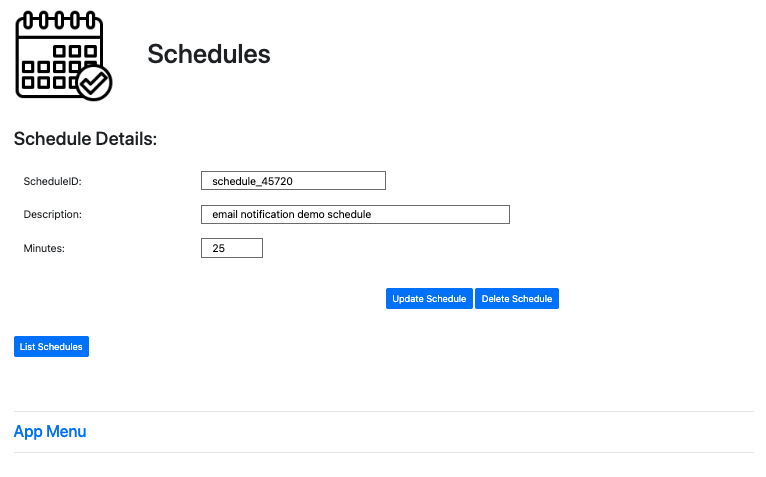
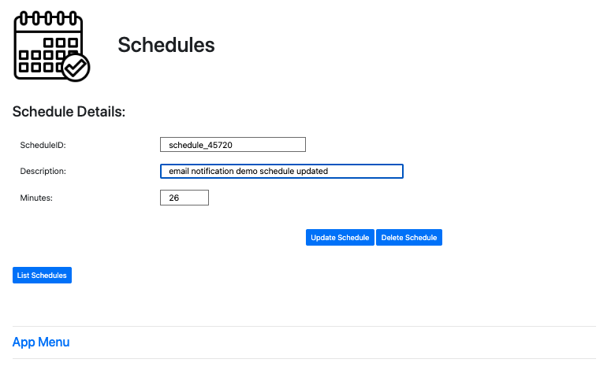
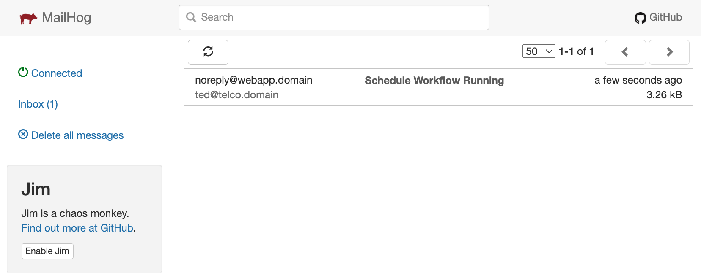
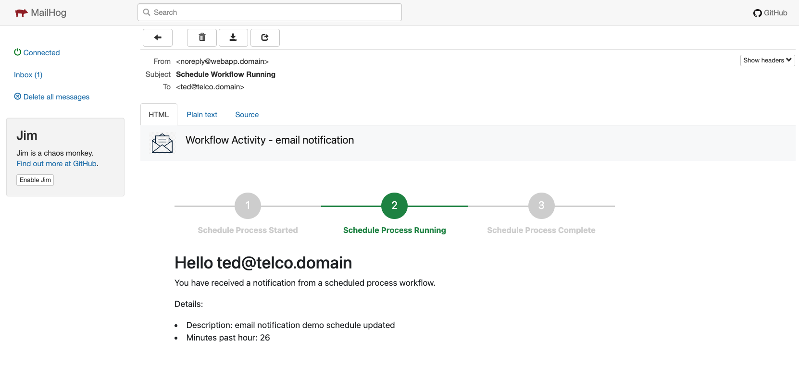
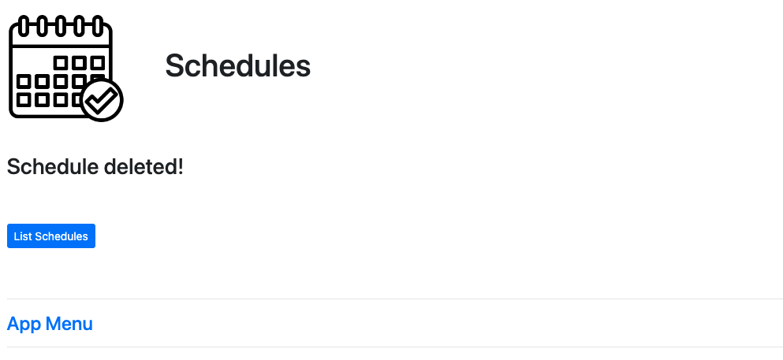
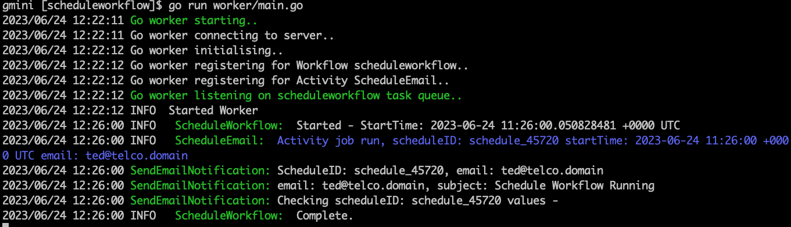

# Temporal Schedule
Quick demo of using temporal schedule feature.  

  
  
## Schedules Demo UI  
Schedules are created with most of the values hardcoded for demoing, the comment and minutes past the hour can be set and updated.  
The workflow activity sends a formatted email to local MailHog docker image UI.

### Create a new schedule
  

### New schedule create acknowledgement
  

### List currently running schedule
  

### Drill down details view of schedule
  

### Amend a schedule, change runtime minutes etc
  

### Schedule workflow calls an Activity that sends an email
  

### Email notification example
  

### Schedule delete acknowledgement
  

### Console output of a Schedule run
  

  
