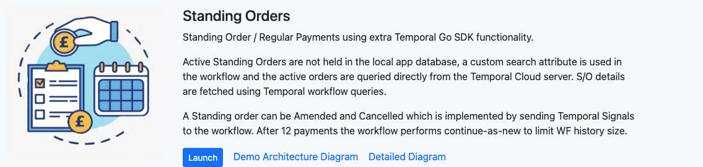
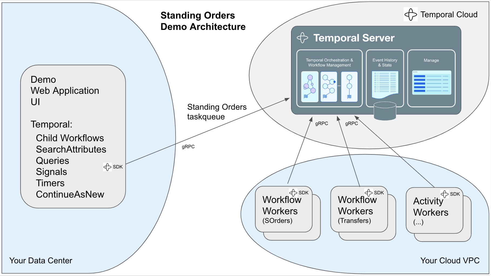
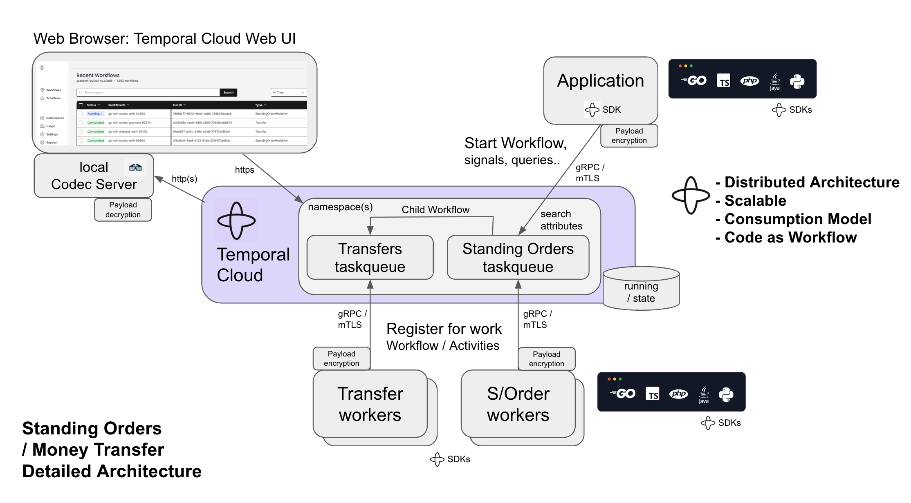
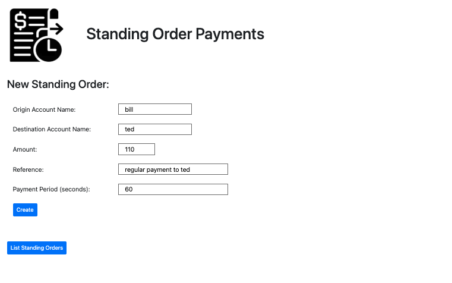
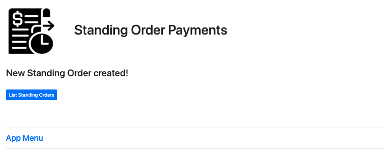
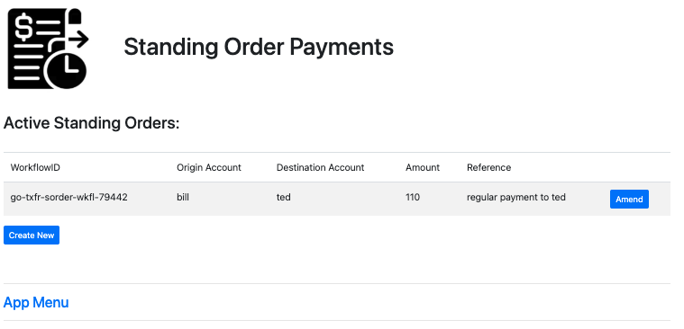
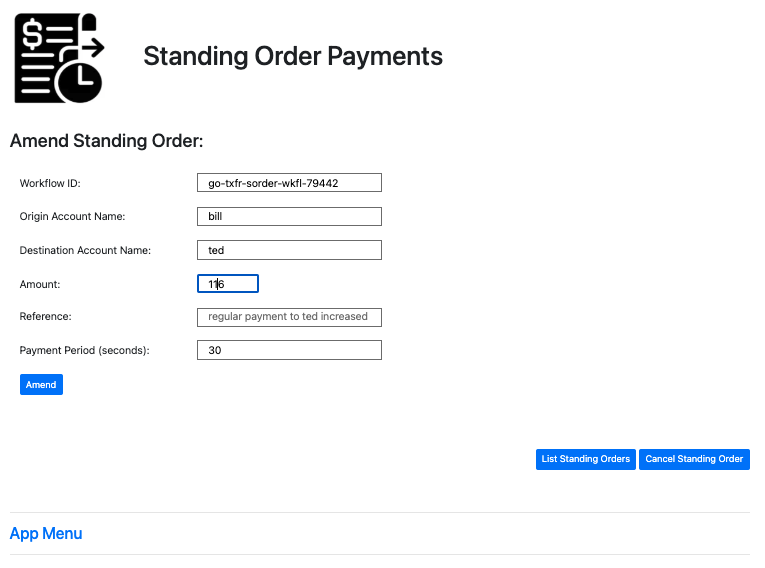
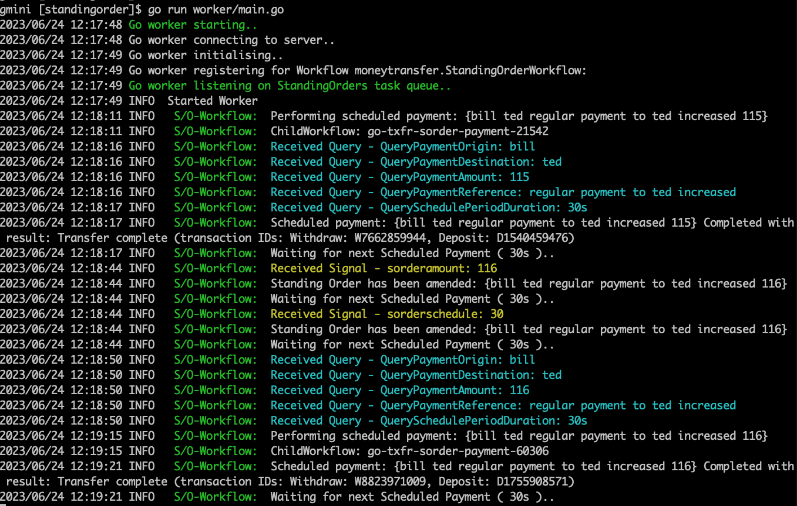

# Standing Orders
Regular Payments from one account to another account, fixed amount with reference comment.  
  
  
  
## Demo Architecture
  

  
## Standing Orders UI
This demo just pays on a timer, amend is handled by temporal queries and signals to read and change current workflow variables.

### Create a new Standing Order
  

### Create acknowledgement
  

### List currently running standing order workflows
  

### Standing Order details, Amend or Delete
  

### Console output from Schedule worker
  
  
